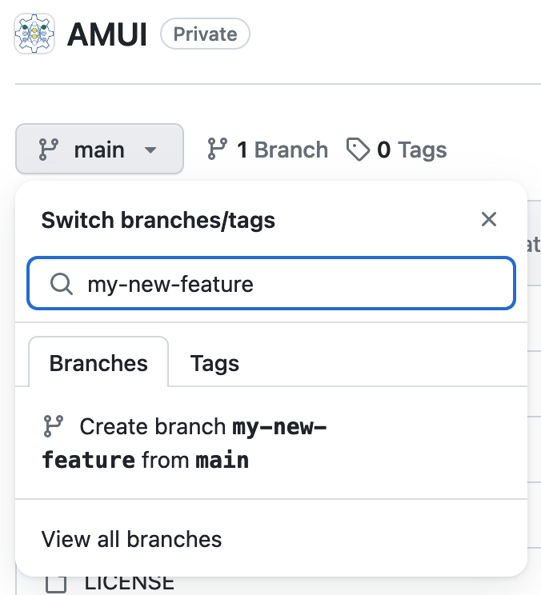
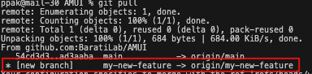
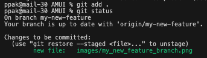
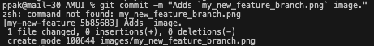
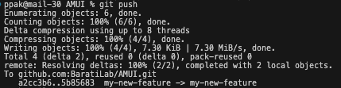
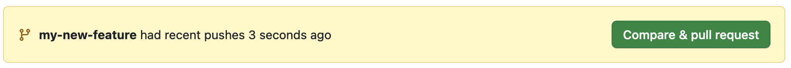
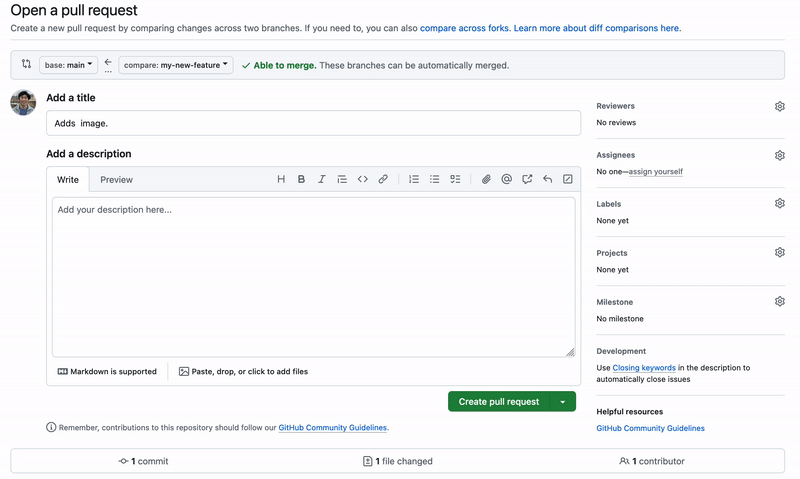
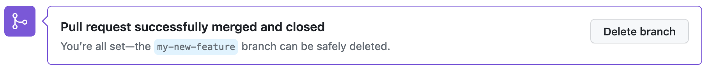

# AMUI
Additive Manufacturing User Interface (AMUI)

## Quickstart
1. Clone the [repository]("https://github.com/BaratiLab/AMUI.git") with your prefered method.
    ```bash
    git clone git@github.com:BaratiLab/AMUI.git
    ```
2. Follow the instructions for downloading and installing [Docker Desktop]("https://www.docker.com/products/docker-desktop/")
    - Make sure the docker compose works here, you'll need it for this project.
    - Creating an account is optional here.
3. Open `AMUI` project in VSCode
4. Duplicate `.env.example` file and rename to `.env`.
    - Fill in the following empty fields (ask @ppak10 if you need help).
5. Open terminal and (under `AMUI` directory) start containers.
    ```bash
    docker-compose up -d
    ```

## Contributing
1. Create new branch on GitHub for your feature off of the [`main`](https://github.com/BaratiLab/AMUI) branch.
    - Provide the new branch with a descriptive feature title like: `README-troubleshooting-updates`.

      
2. Pull newly created branch locally.
    ```bash
    git pull
    ```
    - You see that new branch now

      
3. Make your changes and stage them for commit.
    ```bash
    git add .
    ```
    - This will add all changes.
    - `git status` will show your staged changes in green.

      
4. Commit your changes with a descriptive commit message.
    ```bash
    git commit -m "Your 80 character maximum commit message goes here"
    ```

    
5. Push your changes to GitHub.
    ```bash
    git push
    ```

    
6. Go back to repository on GitHub and create a Pull Request
    - You should see a banner notification about your latest change.
    - Click on the "Compare & pull request" button to create a Pull Request

      
    
    - Add @ppak10 as reviewer and fill in other the necessary details.

      

7. Delete feature branch once pull request is merged
    
8. Pull and Checkout `main` branch locally
    ```bash
    git pull
    git checkout main
    ```
