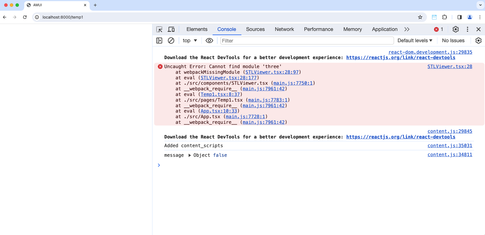

# AMUI-WEB

## Getting Started
1. Follow Quickstart instructions in project level [`README.md`](../README.md)
2. Connect to `amui-web` Docker Container
    1. Open `AMUI/web` in a separate VSCode window.
    2. Install [Dev Containers](https://marketplace.visualstudio.com/items?itemName=ms-vscode-remote.remote-containers) Extension for VSCode.
    3. When in VSCode IDE for folder, click "Reopen in Container" when prompted.
      
        - This will provide you access to container CLI when opening VSCode terminal.
        - It will also provide you with IDE tools while developing.

## Troubleshooting
- Reloading webpage after `git pull` or `git checkout` command results in blank screen.
    1. Right click and open Inspector
    2. If you see a `webpackMissingModule` error like below, you may need to install some new dependencies.
    
    3. Open terminal in VSCode and install these newly added dependencies:
        ```bash
        npm install
        ```
    4. Wait a couple seconds and reload page and the problem should be fixed.
